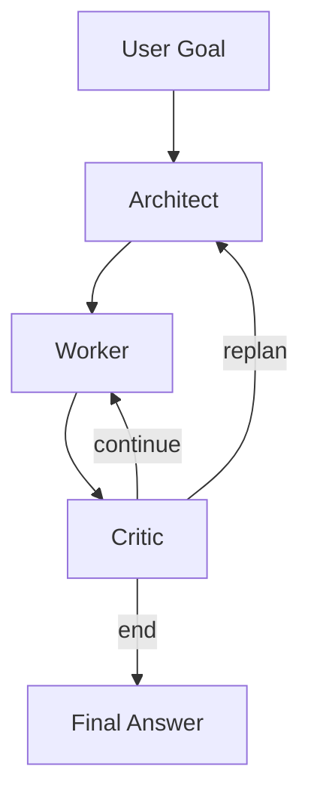

# Agent Framework Architecture (3 Subagents)

## High-Level Flow

## Runtime Boundaries

- `Architect`: Generates/refreshes `plan: list[PlanStep]`.
- `Worker`: Executes one step and optionally calls tools.
- `Critic`: Decides route and stop conditions.

All interfaces are typed with Pydantic models.

## Source Layout

- `src/manus_three_agent/agents/`: Architect/Worker/Critic
- `src/manus_three_agent/graph/`: LangGraph wiring + transitions
- `src/manus_three_agent/tracing/`: event/session writer
- `src/manus_three_agent/training/`: trace -> SFT export
- `src/manus_three_agent/eval/runner.py`: CLI entrypoints

## OpenAI Integration

- `utils/llm.py` wraps OpenAI client (`chat.completions`).
- Strict JSON output parsing with retry and fallback behavior.
- `mock` mode keeps runtime executable without API key.

## Routing Rules

- `continue`: Critic sends execution back to Worker.
- `replan`: Critic requests Architect to refresh plan.
- `end`: run terminates with final artifact + trace summary.
