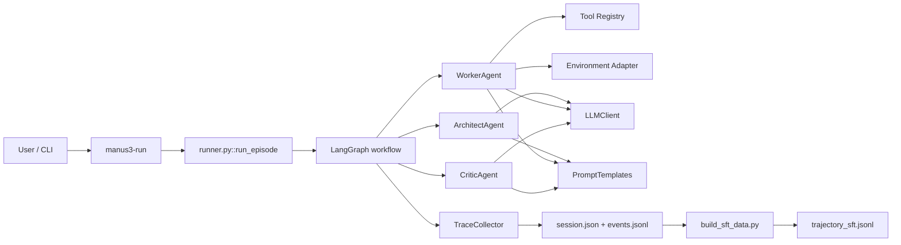
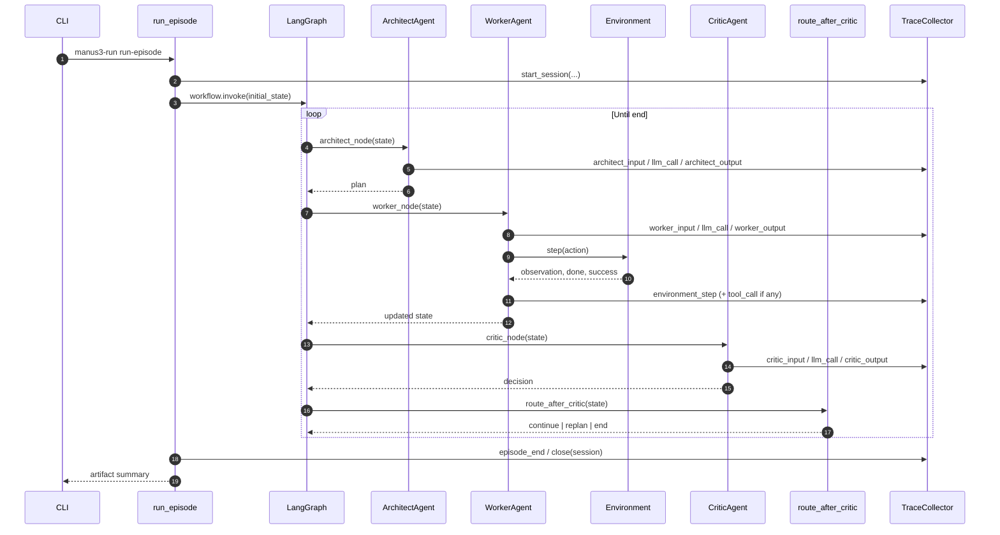
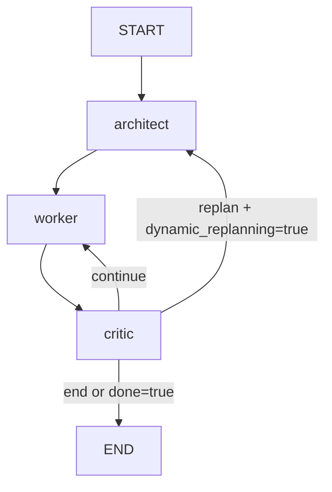
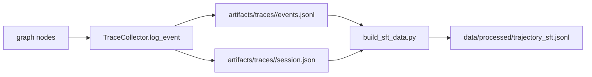

# Current Agent Architecture and Runtime Flow (Reading Roadmap)

This document gives you both:

1. A visual map of the **current implementation architecture**.
2. A practical roadmap for **where to start reading code**.

## 1) Architecture Diagram (Current Implementation)



## 2) Runtime Orchestration Flow (Single Episode)



## 3) State Transition Graph (Deterministic)



## 4) Trace and Training Data Flow



## 5) Source-of-Truth Files

If you need exact implementation details, prioritize these files:

1. Entrypoint and runtime bootstrap
- `pyproject.toml` (`manus3-run` script)
- `src/manus_three_agent/eval/runner.py`

2. Orchestration loop and routing policy
- `src/manus_three_agent/graph/workflow.py`
- `src/manus_three_agent/graph/transitions.py`

3. Role loops (Planner / Worker / Verifier)
- `src/manus_three_agent/agents/architect.py`
- `src/manus_three_agent/agents/worker.py`
- `src/manus_three_agent/agents/critic.py`

4. State and typed contracts
- `src/manus_three_agent/core/state.py`
- `src/manus_three_agent/core/schemas.py`
- `src/manus_three_agent/core/types.py`

5. Tracing and trajectory export
- `src/manus_three_agent/tracing/collector.py`
- `src/manus_three_agent/tracing/schemas.py`
- `src/manus_three_agent/utils/llm.py`
- `src/manus_three_agent/training/build_sft_data.py`

## 6) Recommended Reading Order

1. `pyproject.toml`
2. `src/manus_three_agent/eval/runner.py`
3. `src/manus_three_agent/graph/workflow.py`
4. `src/manus_three_agent/graph/transitions.py`
5. `src/manus_three_agent/core/state.py`
6. `src/manus_three_agent/core/schemas.py`
7. `src/manus_three_agent/core/types.py`
8. `src/manus_three_agent/agents/architect.py`
9. `src/manus_three_agent/agents/worker.py`
10. `src/manus_three_agent/agents/critic.py`
11. `src/manus_three_agent/tracing/collector.py`
12. `src/manus_three_agent/training/build_sft_data.py`
13. `tests/`

## 7) Quick Commands While Reading

```bash
manus3-run run-episode --goal "Explain current architecture" --mock --print-effective-config
manus3-run run-episode --goal "Emit trace sample" --mock --trace
manus3-run build-trajectories --trace-dir artifacts/traces --output data/processed/trajectory_sft.jsonl
```
