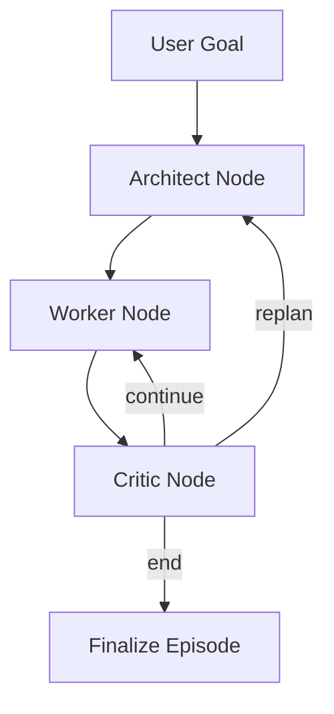

# Manus Agent Orchestration Deep Dive

## 1) Document Purpose

This document explains the orchestration architecture for a three-role agent runtime:

- `Architect` (planner)
- `Worker` (executor)
- `Critic` (verifier/router)

The design target is deterministic control flow and full trace lineage for downstream training data.

## 2) Architectural Principles

1. Routing decisions are explicit in code, not hidden in prompts.
2. Role boundaries are strongly typed with Pydantic schemas.
3. Prompts and hyperparameters are externalized from runtime logic.
4. Every loop emits trace events with `run_id`, `step`, and `event_type`.

## 3) Core Components

- `agents/architect.py`: generates plan steps.
- `agents/worker.py`: executes one step and invokes tools when needed.
- `agents/critic.py`: returns `continue`, `replan`, or `end` decisions.
- `graph/workflow.py`: LangGraph node wiring and transition hooks.
- `eval/runner.py`: runtime bootstrap, config loading, and CLI overrides.
- `tracing/*`: writes `session.json` and `events.jsonl`.

## 4) Control Flow

## 5) State Machine (Condensed)

Primary state (`ManusState`) fields:
- `goal`, `observation`
- `plan`, `current_step_idx`
- `action_history`, `review_history`
- `step_count`, `max_steps`
- `done`, `success`, `final_answer`
- `decision`, `dynamic_replanning`, `use_cot`

Transition rules:
1. `Architect -> Worker` after a valid plan is produced.
2. `Worker -> Critic` after each action/environment update.
3. `Critic -> Worker` when `decision=continue`.
4. `Critic -> Architect` when `decision=replan` and replanning is enabled.
5. `Critic -> END` when `decision=end` or `done=True`.

## 6) Failure Model

- If `step_count >= max_steps`, terminate with `success=False`.
- If JSON parsing/API calls fail, emit `episode_error` and close the run as failed.
- If worker execution context is invalid (for example, missing valid plan), route to replan or end based on runtime policy.

## 7) Tracing and Trajectory Lineage

Each run emits:
- `artifacts/traces/<run_id>/session.json`
- `artifacts/traces/<run_id>/events.jsonl`

Key event types:
- `architect_input`, `architect_output`
- `worker_input`, `worker_output`
- `critic_input`, `critic_output`
- `llm_call`
- `tool_call`
- `episode_end`, `episode_error`

SFT exporter mapping strategy:
- `llm_call` -> prompt/response training records
- role-boundary events -> transition-supervision records

## 8) Prompt and Hyperparameter Controls

## Prompt controls

- Base prompts: `configs/prompts/*.yaml`
- Prompt override file: `--prompt-override <file.yaml>`
- Prompt context variables: `--prompt-context <file.yaml>`
- Custom prompt directory: `--prompts-dir <path>`

## Hyperparameter controls

- Base model config: `configs/models.yaml`
- Model override file: `--model-override <file.yaml>`
- CLI role overrides:
  - `--architect-model`, `--architect-temperature`, `--architect-top-p`, `--architect-max-completion-tokens`
  - equivalent flags for `worker` and `critic`

## 9) Why This Fits Agent Architects and Data Scientists

- Agent Architects get explicit transition logic and testable router behavior.
- Data Scientists get complete run lineage for offline curation, slicing, and evaluation.

## 10) Recommended Extensions

1. Add Planner memory layers (episodic + semantic memory).
2. Add Critic confidence scoring for reward-modeling workflows.
3. Add OTLP export for centralized trace backends.
4. Add dataset integrity checks (dedup, leakage, split validation).
