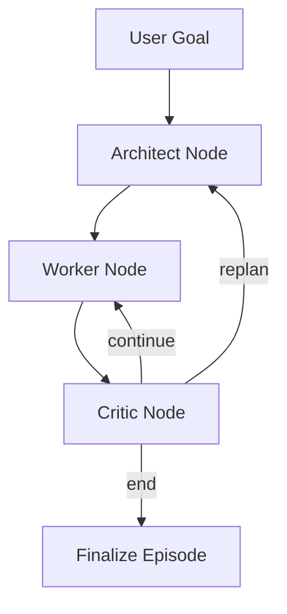

# Manus Agent Orchestration Deep Dive

## 1. Mục tiêu tài liệu

Tài liệu này phân tích chi tiết kiến trúc orchestration cho agent 3 vai trò:
- `Architect` (planner)
- `Worker` (executor)
- `Critic` (review/router)

Mục tiêu là runtime quyết định rõ ràng, có trace lineage đầy đủ để phục vụ training data.

## 2. Nguyên tắc kiến trúc

1. Deterministic routing trong code, không ẩn trong prompt.
2. Role boundary typed bằng schema (Pydantic).
3. Prompt và hyperparameters cấu hình ngoài code.
4. Mỗi vòng lặp đều sinh trace event có `run_id`, `step`, `event_type`.

## 3. Thành phần chính

- `agents/architect.py`: sinh plan steps.
- `agents/worker.py`: thực thi từng step, gọi tool nếu cần.
- `agents/critic.py`: quyết định `continue/replan/end`.
- `graph/workflow.py`: wiring LangGraph nodes + routing.
- `eval/runner.py`: nạp config, override, bootstrap run.
- `tracing/*`: ghi `session.json` + `events.jsonl`.

## 4. Luồng điều khiển

## 5. State machine (rút gọn)

State chính (`ManusState`):
- `goal`, `observation`
- `plan`, `current_step_idx`
- `action_history`, `review_history`
- `step_count`, `max_steps`
- `done`, `success`, `final_answer`
- `decision`, `dynamic_replanning`, `use_cot`

### Transition rules

1. `Architect -> Worker`: luôn sau khi có plan mới.
2. `Worker -> Critic`: sau mỗi action/env step.
3. `Critic -> Worker` nếu `decision=continue`.
4. `Critic -> Architect` nếu `decision=replan` và replanning bật.
5. `Critic -> END` nếu `decision=end` hoặc `done=True`.

## 6. Failure model

- Nếu `step_count >= max_steps`: stop với `success=False`.
- Nếu model parse lỗi/API lỗi: emit `episode_error`, close session `failed`.
- Nếu worker không có plan hợp lệ: yêu cầu `replan` hoặc `end` theo runtime config.

## 7. Tracing & trajectory lineage

Mỗi run tạo:
- `artifacts/traces/<run_id>/session.json`
- `artifacts/traces/<run_id>/events.jsonl`

Event quan trọng:
- `architect_input/output`
- `worker_input/output`
- `critic_input/output`
- `llm_call`
- `tool_call`
- `episode_end` / `episode_error`

SFT exporter sẽ map:
- `llm_call` thành prompt-response records
- role boundary `_input/_output` thành transition supervision records

## 8. Cơ chế cấu hình prompts/hyperparameters

### Prompt

- Prompt gốc: `configs/prompts/*.yaml`
- Override prompt: `--prompt-override <file.yaml>`
- Context variables: `--prompt-context <file.yaml>`
- Custom directory: `--prompts-dir <path>`

### Hyperparameters

- Base model config: `configs/models.yaml`
- File override: `--model-override <file.yaml>`
- Quick CLI override theo role:
  - `--architect-model`, `--architect-temperature`, `--architect-top-p`, `--architect-max-completion-tokens`
  - tương tự cho `worker`, `critic`

## 9. Tại sao phù hợp Agent Architect / Data Scientist

- Architect: kiểm soát transition matrix rõ và kiểm chứng bằng unit tests.
- Data Scientist: toàn bộ run có lineage dữ liệu để huấn luyện/đánh giá offline.

## 10. Hướng mở rộng khuyến nghị

1. Thêm Planner memory store (episodic + semantic).
2. Thêm Critic scoring (0-1) để phục vụ reward modeling.
3. Thêm OTLP exporter cho trace backend tập trung.
4. Bổ sung dataset checks (dedup, leakage, split integrity).
